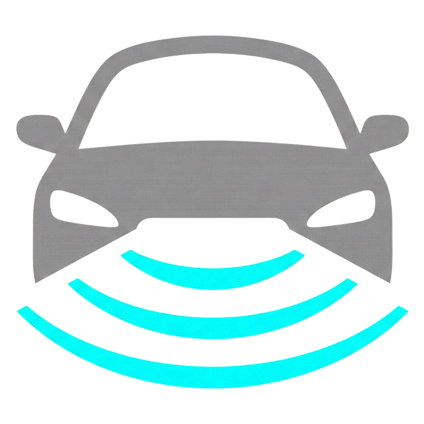
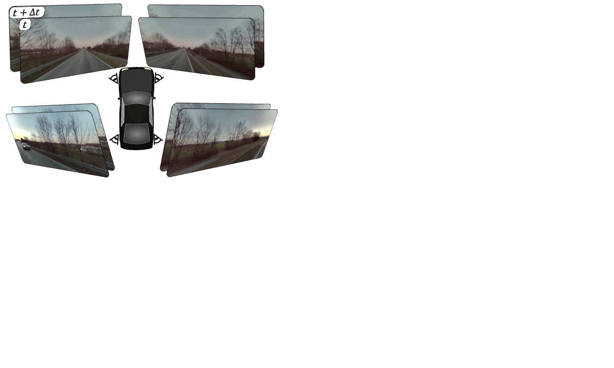
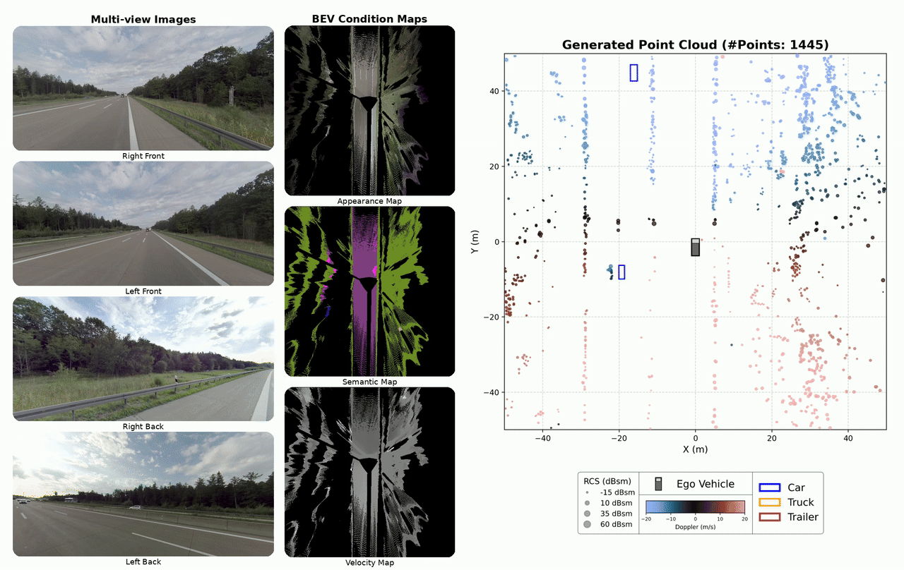

#  RadarGen: Automotive Radar Point Cloud Generation from Cameras

<div align="center">
  <a href="https://radargen.github.io/"></a> &ensp;
  <a href="https://arxiv.org/abs/2512.17897"></a> &ensp;
</div>


### 💡 TL;DR: RadarGen generates sparse radar point clouds from multi-view camera images.

<p align="center">
  
</p>

<p align="center">
  
</p>


## 🔥 News
- [ ] Evaluation code is coming soon.
- [x] [2025/03] RadarGen's inference and training pipelines for MAN TruckScenes and nuScenes are now available.
- [x] [2025/12] [Paper](https://arxiv.org/abs/2512.17897) is on Arxiv!


## 🛠️ Installation

### Prerequisites
- Python >= 3.10
- CUDA 12.1
- Conda

### Clone the Repository

```bash
git clone --recursive https://github.com/your-org/RadarGen.git
cd RadarGen
```

> **Note:** The `--recursive` flag is required to fetch the [UniDepth](https://github.com/lpiccinelli-eth/UniDepth) and [UFM](https://github.com/UniFlowMatch/UFM) submodules.
> If you already cloned without it, run: `git submodule update --init --recursive`

### Install

```bash
bash environment_setup.sh radargen
conda activate radargen
```

This will install RadarGen and all dependencies including:
- PyTorch 2.4.0 with CUDA 12.1
- UniDepth
- UFM

For manual installation, follow the steps in [`environment_setup.sh`](environment_setup.sh).

> **Note:** A GPU is required for the installation of UniDepth.

### Dataset Setup

We support multiple autonomous driving datasets. To get started, download and set up one of the following:

**TruckScenes**:
- Download: [truckscenes.com](https://truckscenes.com)
- Install devkit: `pip install truckscenes-devkit`

**nuScenes**:
- Download: [nuscenes.org](https://www.nuscenes.org/nuscenes)
- Install devkit: `pip install nuscenes-devkit`

After downloading, update the configs in `configs/*.yaml` and `configs/preprocessing/*.yaml` to point to your dataset location.


## 🚀 Quick Start

### Inference

Run inference on TruckScenes using the provided notebook: `notebooks/inference_truckscenes.ipynb`

Or use the Python API:

```python
from radargen.inference import RadarGenInference
from radargen.datasets import get_adapter

# Load dataset adapter
adapter = get_adapter("truckscenes", trucksc=trucksc_obj)

# Initialize model
model = RadarGenInference(
    adapter=adapter,
    config_path="configs/RadarGen_600M_512px_TS_inference.yaml",
    checkpoint_path="path/to/checkpoint"
)

# Generate point cloud from two consecutive frames
pcl = model.from_sample_data(sample_t0, sample_t1)
```

**Download pretrained models:**

Pretrained model weights are available through huggingface.

- MAN TruckScenes: 
  - Link: https://huggingface.co/TomerBo/RadarGen_600M_512px_TS/
  - Path: `hf://TomerBo/RadarGen_600M_512px_TS/RadarGen_600M_512px_TS.safetensors`
- nuScenes: Coming soon


## 🏋️ Training

### 📊 Data Preparation

Before training, you need to create BEV conditioning maps and ground truth radar maps:

#### 1. Create BEV Conditioning Maps

First, edit `configs/preprocessing/truckscenes_bev_maps.yaml` to set your dataset and output paths.

```bash
# Single GPU
python scripts/create_bev_maps.py \
    --config_path configs/preprocessing/truckscenes_bev_maps.yaml

# Multi-GPU (8 GPUs)
bash scripts/run_create_bev_maps.sh 8 \
    --config_path configs/preprocessing/truckscenes_bev_maps.yaml
```

This creates RGB appearance, semantic segmentation, and velocity maps in bird's eye view.

#### 2. Create Ground Truth Radar Maps

First, edit `configs/preprocessing/truckscenes_radar_maps.yaml` to set your dataset and output paths.

```bash
# Single GPU
python scripts/create_radar_maps.py \
    --config_path configs/preprocessing/truckscenes_radar_maps.yaml

# Multi-GPU (8 GPUs)
bash scripts/run_create_radar_maps.sh 8 \
    --config_path configs/preprocessing/truckscenes_radar_maps.yaml
```

This creates Point Density, RCS, and Doppler maps from the ground truth radar data.


### Training on TruckScenes

1. **Prepare the config file**

   Edit `configs/RadarGen_600M_img512_TS_training.yaml` to set your data paths:

   ```yaml
   data:
     dataset_dir: /path/to/man-truckscenes  # TruckScenes dataset location
     radar_maps_dir: "radar_maps/"          # Pre-computed radar maps (relative to dataset_dir)
     bev_conditioning_maps_dir: "bev_maps/" # Pre-computed BEV maps (relative to dataset_dir)
   ```

2. **Run training**

   ```bash
   # 8 GPUs (default)
   bash scripts/train.sh configs/RadarGen_600M_img512_TS_training.yaml

   # Custom number of GPUs
   NUM_GPUS=4 bash scripts/train.sh configs/RadarGen_600M_img512_TS_training.yaml

   # Single GPU with custom arguments
   python scripts/train.py \
       --config_path configs/RadarGen_600M_img512_TS_training.yaml \
       --train.num_epochs=100
   ```


## Acknowledgements
We thank the following open-source codebases for their wonderful work: [SANA](https://github.com/NVlabs/Sana/), [DC-AE](https://github.com/mit-han-lab/efficientvit), [UniDepth](https://github.com/lpiccinelli-eth/UniDepth), [UFM](https://github.com/UniFlowMatch/UFM), [Mask2Former](https://github.com/facebookresearch/Mask2Former).


## License
This repository's code inherits its license from the following open-source projects:
- SANA: [Apache-2.0](https://github.com/NVlabs/Sana/blob/main/LICENSE)
- UniDepth: [CC BY-NC 4.0](https://github.com/lpiccinelli-eth/UniDepth/blob/main/LICENSE)
- Mask2Former: [MIT License](https://github.com/facebookresearch/Mask2Former/blob/main/LICENSE)
- UFM: [BSD 3-Clause](https://github.com/UniFlowMatch/UFM/blob/main/LICENSE)

The pre-trained RadarGen checkpoint inherits its license from SANA's weights and the dataset it was trained on:
- SANA weights: [NSCL v2-custom](https://huggingface.co/Efficient-Large-Model/Sana_1600M_512px_MultiLing_diffusers/blob/main/LICENSE.txt)
- MAN TruckScenes: [CC BY-NC-SA 4.0](https://creativecommons.org/licenses/by-nc-sa/4.0/)

Please refer to the respective repositories and datasets for full license details.


## 📖 BibTeX

If you find our work useful, please consider starring ⭐ the repository and citing our paper:

```
@article{borreda2025radargen,
      title={RadarGen: Automotive Radar Point Cloud Generation from Cameras},
      author={Borreda, Tomer and Ding, Fangqiang and Fidler, Sanja and Huang, Shengyu and Litany, Or},
      journal={arXiv preprint arXiv:2512.17897},
      year={2025}
}
```


